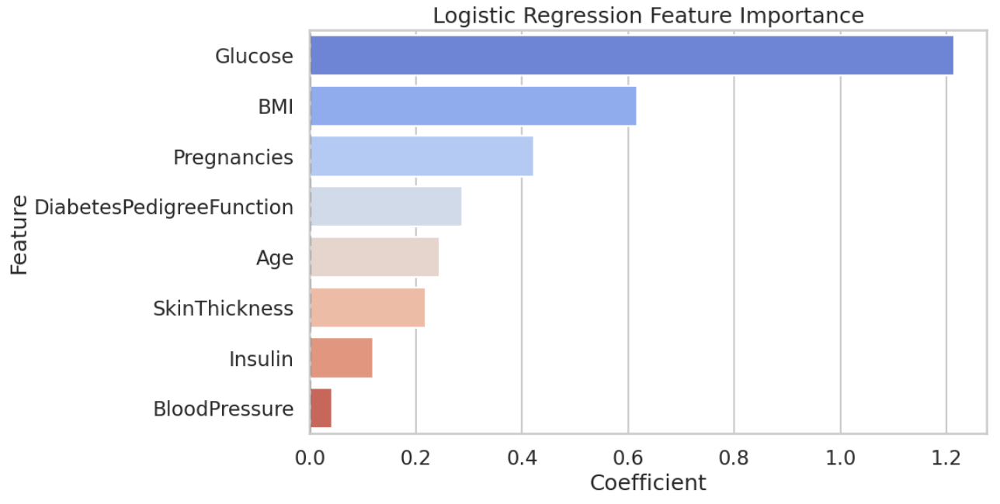

# 🧠 Diabetes Prediction Project

This project explores the Pima Indians Diabetes dataset to predict the onset of diabetes using various machine learning models.

## 📊 Dataset
- **Source:** [Kaggle](https://www.kaggle.com/datasets/uciml/pima-indians-diabetes-database)
- **Size:** ~8 features, 768 observations
- **Target variable:** Outcome

## 📋 Project Steps
- Data Cleaning and Imputation (KNN Imputer)
- Exploratory Data Analysis (EDA)
- Feature Engineering
- Model Building (Logistic Regression, Random Forest, KNN, XGBoost)
- Model Evaluation (ROC AUC, F1 Score, Confusion Matrix)
- Threshold Tuning for better recall
- Saving the final model

## 🏆 Final Results
- **Best Model**: Logistic Regression
- **ROC AUC Score**: ~0.81
- **Top Features**: Glucose, BMI, Pregnancies

## 📊 Models and Results

| Model              | Accuracy   | F1 Score    | F1 Score    |
|--------------------|------------|-------------|-------------|
|    Random Forest   |  0.727273  |  0.580000   |  0.820463   |
| Logistic Regression|  0.733766  |  0.649573   |  0.813148   |
|       XGBoost      |  0.714286  |  0.584906   |  0.806667   |
| K-Nearest Neighbors|  0.714286  |  0.596154   |  0.765926   |

## 🛠️ Tools Used
- Python
- Pandas, Numpy
- Matplotlib, Seaborn
- Scikit-Learn
- XGBoost

## 📈 Key Learnings
- How to handle missing values and imbalance in data.
- Importance of feature scaling and proper model evaluation.
- How to tune model thresholds to balance precision and recall.

## 📂 Files
- `diabetes-final notebook.ipynb`: Main notebook
- `logistic_regression_diabetes.pkl`: Saved model file

## 🧠 Author
👩‍💻 Mozhdeh Talebian  
📍 Biomedical Engineering background + Data Science Enthusiast

